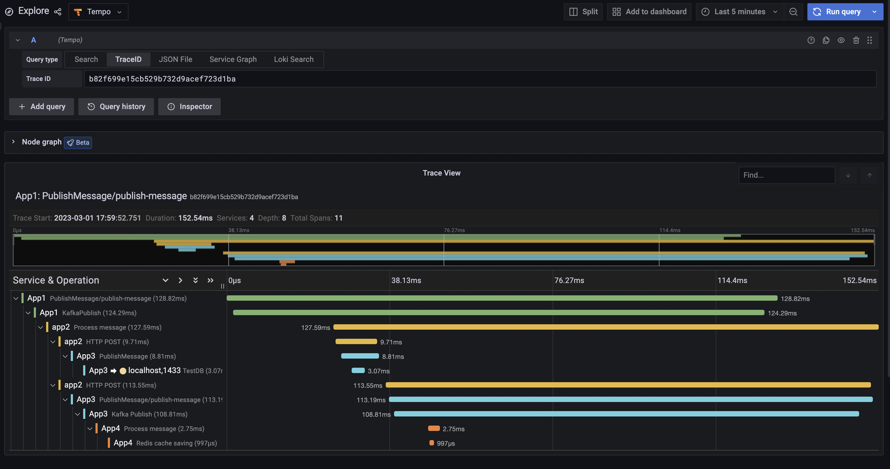
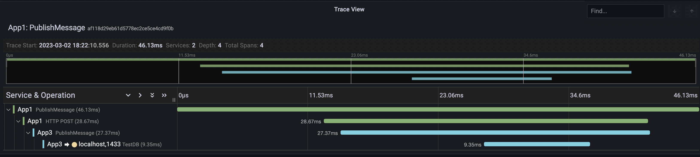

# Open Telemetry Example With Micro service

Its a list of sample applications involving interactions between each other to mimic the behaviour of
a micro services. This application uses 2 types of communication for interaction, one is rest based
http protocol and other one is asynchronous communication using kafka.

1. It uses open telemetry API and its Dot.net SDK for tracing.
2. It uses available open telemetry instrumentation library for asp.et core, http calls and SQL etc.
3. It uses custom tracing for Kafka since there is no instrumentation library yet.
4. It Uses Open telemetry exporter for collection of all the traces.
5. It uses Prometheus for metrics collection and it is integrated with Grafana as a front end to display the metrics.
6. It uses grafana as the backend for setting up of dashboards.
7. Uses Prometheus Alerts manager for sending alerts(yet to be implemented).
8. All data is getting stored locally now but can be integrated with different data source. For that, please look the documentation for each.

## How to set up

1. Run docker compose up from root of the downloaded application
2. Then run each application locally using Rider or VS studio or VS code.
3. Go to http://localhost:3000/ and select Tempo as source to check tracing.
4. Go to http://localhost:9090/ to check for metrics in prometheus or http://localhost:3000/ and select Prometheus as data source.
5. Go to http://localhost:3000/ for grafana and select Loki for logs, tempo for tracing and Prometheus as data source for metrics

## Micro service Architecture

### Here is the explanation of the flow.

1. Executor is the worker service which makes 2 http post call to /Message and /Message/Post-Message in App1(Api) for every 5000MS
2. /Message of App1 API makes call to another API App3(/PostMessage) and it will add the data to SQL DB.
3. /Message/Post-Message of APP1 API will send a message to Kafka topic "Purchase" and returns a response.
4. App2 which is a console application which will consume message from Kafka topic "Purchase" and sends it to App3 API(/Message/Post-Message).
5. /Message/Post-Message of App3 API will send message to Kafka topic "Purchase2" and returns response.
6. App4 worker service will consume data from Kafka topic "Purchase2" and saves it in Redis cache.

### PublishMessage end point flow

### PublishMessage/Publish-Message end point flow

## Tracing

I have used Open telemetry for tracing with Grafana Tempo as backend for displaying traces.

### What insight you will be getting from tracing?

1. How much time it took to complete entire flow?
2. How much time Db calls are taking?
3. How much time kafka message posting is taking?
4. How much time Redis operations are taking?
5. With these information, we can identify any bottleneck and performance related issues.

## Metrics

I have used prometheus for scraping metrics and set up Prometheus as data source in Grafana so that
we could see metrics in Grafana dashboard itself.

### What insight you will be getting from metrics dashboard?

1. You can monitor your API end points.
2. You can monitor dot.net run time related data such as memory etc.
3. You can monitor your docker container by configuring container to emit metrics.
4. You can monitor kubernetes cluster as well.
5. With the metrics, you can set up alerting and take actions to corrective measures.

## Logging

I have used Grafana loki for application logging with serilog. And you will be able to search
logs with trace id and find all the logs related to functionality even when the flow involves
inter service communications.

Reference:
[Open Telemetry](https://opentelemetry.io/docs/)
[Jaeger](https://www.jaegertracing.io/docs/1.42/)
[ZipKin](https://zipkin.io/)
[Prometheus](https://prometheus.io/docs/concepts/metric_types/)
[Open Telemetry Registry](https://opentelemetry.io/ecosystem/registry)
[Grafana](https://grafana.com/)
